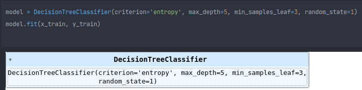
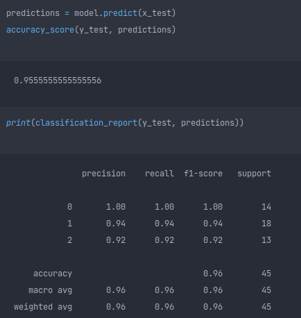

# Relatório do Modelo de Árvore de Decisão

O dataset não veio com suas colunas nomeadas, então elas foram adicionadas conforme a Figura 1.

 

Figura 1

Essa renomeação de colunas foi feita seguindo as descrições disponibilizadas no seguinte documento:

Figura 2

Tal documento está disponível para download no mesmo link do dataset disponibilizado para o projeto.

Em um primeiro momento foi analisado o dataset para verificar a necessidade de qualquer processamento mais sofisticado. Porém. Ele parece bem balanceado [Figura 3], então técnicas de balanceamento não foram necessárias.

Figura 3

Devido a isso, a única adaptação feita no dataset foi a mudança dos nomes de espécies das plantas de seu nome original para um identificador único como mostrado abaixo.

Figura 4

Finalizada essa parte inicial, foi feita a divisão dos dados em treino e teste. Obedecendo os 30% dos dados disponíveis para validação.

Figura 5

Por fim, foi feito o treino do modelo.

Figura 6

Como pode ser observado, foi utilizada entropy como métrica para a Decision Tree. Isso se deve exclusivamente ao fato de, pelas pesquisas realizadas, a métrica gini ser utilizada para datasets muito grandes, onde o tempo de treino pode ser impactado positivamente por ela. 

### Resultados

Feito o treino, foi avaliada a acurácia de previsão do modelo e também foi gerado um relatório de classificação de descriminação entre as espécies de plantas e um detalhamento maior sobre a acurácia.

Figura 7

Analisando esses resultados, verificamos que para a classe Iris-setosa (0) foi predita com mais exatidão que as demais. Sendo que a classe Iris-virginica (2) foi a com menor precisão.
Apesar disso, analisando o modelo no geral, foi atingida uma acurácia de aproximadamente 96%.
